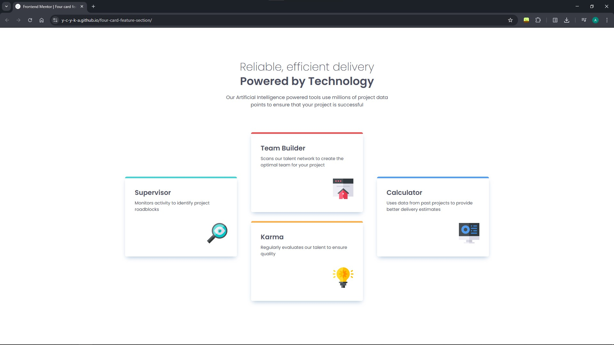
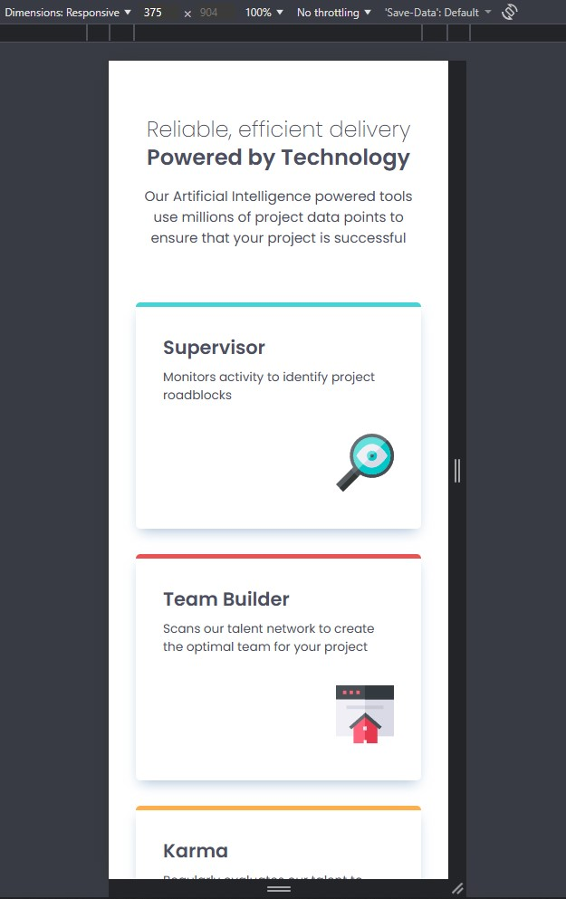

# Frontend Mentor - Four card feature section solution

This is a solution to the [Four card feature section challenge on Frontend Mentor](https://www.frontendmentor.io/challenges/four-card-feature-section-weK1eFYK). 
Frontend Mentor challenges help improve coding skills by building realistic projects. 

## Table of contents

- [Overview](#overview)
  - [The challenge](#the-challenge)
  - [Screenshot](#screenshot)
  - [Links](#links)
- [My process](#my-process)
  - [Built with](#built-with)
  - [What I learned](#what-i-learned)
  - [Continued development](#continued-development)

## Overview

### The challenge

Users should be able to:

- View the optimal layout for the site depending on their device's screen size

### Screenshot

### Links

- Solution on github URL: [https://github.com/y-c-y-k-a/four-card-feature-section](https://github.com/y-c-y-k-a/four-card-feature-section)
- Live Site on github pages URL: [https://y-c-y-k-a.github.io/four-card-feature-section/](https://y-c-y-k-a.github.io/four-card-feature-section/)

## My process

### Built with

- Semantic HTML5 markup
- CSS custom properties
- Flexbox
- CSS Grid

### What I learned

Обновил в памяти как работать с flexbox и grid. Узнал про CSS функцию clamp().

### Continued development

В дальнейшем нужно будет проработать grid, поскольку на данный момент понимание поверхностное и неструктурированное. 